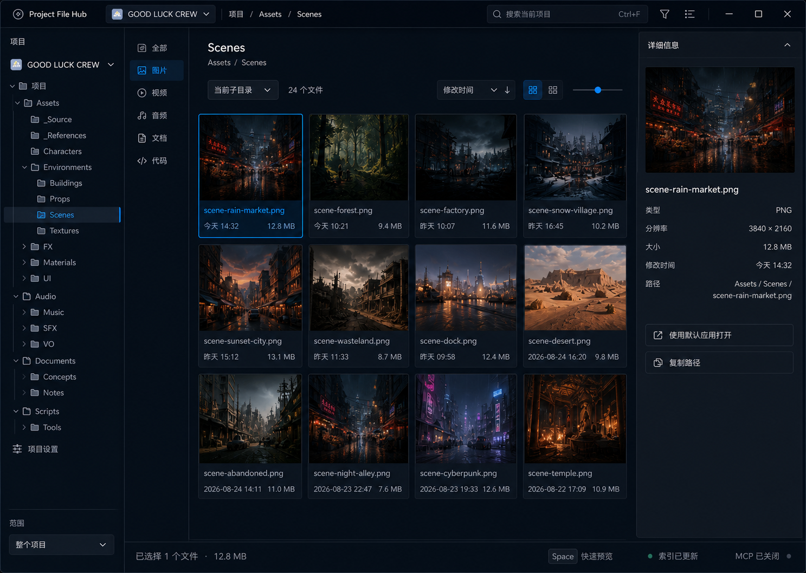

<p align="center">
  
</p>

<h1 align="center">Project File Hub</h1>

<p align="center">
  一个面向 Windows 11 的项目级文件管理器。<br />
  Stable project navigation, focused file workflows, and a macOS-like Space Preview.
</p>

<p align="center">
  
  
  
  
</p>

> [!IMPORTANT]
> `0.0.3` 是开发预览版本，适合本机试用和继续开发。目前尚未提供安装程序、代码签名或正式发布包。

## 为什么做这个项目

Windows 资源管理器适合浏览整个系统，却不一定适合长期管理越来越多的创作和开发项目。Project File Hub 把工作空间限制在用户明确添加的项目中：一次只打开一个项目，切换项目时恢复之前的位置，并尽量减少误跳目录、迷失上下文和重复查找文件的成本。

它不是 Windows Shell 的完整替代品，也不是知识库，而是一套更专注、更稳定的项目文件工作流。

## 0.0.3 功能概览

- **项目级工作空间**：可以登记多个项目，但同一时间只激活一个；所有导航和文件操作都受当前项目根目录约束。
- **可靠的项目记忆**：项目列表使用带修订号的主记录、独立 Roaming 备份和上一版本快照；主记录被清空、损坏或丢失时可以恢复。
- **稳定的目录树**：惰性加载子目录，支持单击选择、双击展开/收起、自然排序和更大的树节点点击区域。
- **网格与列表浏览**：30 个常用文件图标家族覆盖 221 种扩展名；图片优先显示真实缩略图，列表保持统一图标尺寸与独立类型列。
- **清晰的文件状态**：网格文件名使用稳定的两行区域，悬停可查看完整名称，网格与列表都有明确的选中反馈。
- **Space Preview**：选中文件后按空格打开 Hub 内单文件预览；方向键或预览箭头切换相邻文件，`Esc` 关闭。
- **阅读与代码预览**：Markdown 使用结构化阅读视图，代码使用 Monokai 风格语法配色，文本类预览可切换自动换行。
- **图片查看**：鼠标滚轮以视口中心缩放，放大后可以拖动查看。
- **常用文件操作**：右键菜单、F2 重命名、拖放移动、Ctrl 拖放复制、批量选择、复制/粘贴、复制到、移动到、回收站和可用时的撤销。
- **Windows Shell 协作**：可以从文件、文件夹或当前目录直接跳转到资源管理器；详情和预览文字支持选择与复制。
- **当前文件夹筛选**：按图片、视频、音频、文档、代码等类别筛选当前树目录，包含取消、进度反馈、分批呈现和过期请求保护。
- **Focus Canvas 界面**：提供 Dark · Midnight、Dark · Graphite 和 Light · Mist 三套主题，以及多种界面密度。
- **Windows 集成**：原生圆形 F 图标、任务栏身份、通知区域驻留、后台索引、左键双击恢复并置前主窗口，以及完整退出菜单。
- **可选 MCP 适配器**：独立、默认关闭、只读；桌面应用本身不依赖 MCP 或云服务。

## 常用快捷键

| 快捷键 | 功能 |
| --- | --- |
| `Space` | 打开或关闭单文件快速预览 |
| `←` / `→` | 在预览结果集中切换文件 |
| `Esc` | 关闭预览或退出当前临时状态 |
| `Enter` | 打开所选项目 |
| `F2` | 重命名所选文件或文件夹 |
| `Ctrl+A` | 选择当前文件视图中的全部项目 |
| `Ctrl+C` / `Ctrl+V` | 复制和粘贴 |
| `Delete` | 确认后移入 Windows 回收站 |

## 从源码构建

### 环境要求

- Windows 11 x64
- PowerShell 7 或 Windows PowerShell
- 仓库指定的 .NET SDK（见 [`global.json`](global.json)）
- Windows App SDK/WinUI 3 所需的本机构建环境

### 构建与测试

```powershell
# 自动化核心测试
.\eng\run-core-tests.ps1

# 还原并构建完整解决方案
.\eng\build.ps1
```

调试版本默认输出到：

```text
src/ProjectFileHub.App/bin/Debug/net10.0-windows10.0.22621.0/win-x64/
```

如果程序正在通知区域后台运行，请先在圆形 F 图标的右键菜单中选择“完全退出”，再重新构建。

## 项目结构

```text
src/
  ProjectFileHub.App/        WinUI 3 桌面应用与 Windows 集成
  ProjectFileHub.Core/       项目边界、浏览、索引、预览和文件操作服务
  ProjectFileHub.McpServer/  可选、默认关闭的只读 MCP 适配器
tests/
  ProjectFileHub.Core.Tests/ 轻量自动化核心测试
eng/                         构建、测试和图标生成脚本
docs/                        面向使用者和开发者的补充文档
```

## 数据与隐私

Project File Hub 的核心浏览和文件操作完全在本机完成，不要求云服务。

用户状态不会写进所管理的项目目录：

- 项目列表主记录：`%LOCALAPPDATA%\ProjectFileHub\projects.json`
- 项目列表独立备份：`%APPDATA%\Anjero\ProjectFileHub\projects.backup.json`
- 界面和项目工作区设置：`%LOCALAPPDATA%\ProjectFileHub\settings.json`
- 本地 SQLite 索引：应用本地数据目录

符号链接、目录联接、拖放和可选 MCP 读取都必须遵守当前活动项目根目录边界。

## 可选 MCP

MCP 服务器不是桌面应用依赖项，也不会默认启动。当前适配器仅提供活动项目信息、受边界约束的列表/搜索和有限文本读取。配置与工具说明见 [`docs/MCP.md`](docs/MCP.md)。

## 后续计划

- 将 Windows Shell Preview Handler 放入独立进程，降低第三方预览提供程序影响主界面的风险。
- 完善安装、签名、升级和发布流程。
- 持续改进键盘操作、可访问性、高对比度和缩放体验。

## 反馈

这是一个仍在快速迭代的自用工具项目。欢迎通过 GitHub Issues 提交可复现的问题、交互建议和 Windows 文件工作流需求。

## 界面预览

当前 Focus Canvas 主界面方向：项目树、文件类型筛选、资源网格与详情面板。


